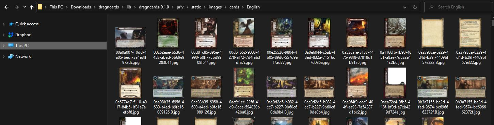

# DragnCardsOffline
Run a [DragnCards](https://github.com/seastan/DragnCards) instance natively on Windows.

## Usage
1. Download and extract the latest [release](https://github.com/dsvz/DragnCardsOffline/releases).
2. Run `DragnCards.exe`. The launcher will attempt to download and install the card images. Then it will start the DragnCards server instance.
3. Go to http://localhost:4000.
4. Login using `player1@dragncards.com` / `password1`. New user creation does not work in this distribution.
5. To stop the instance, close the `DragnCards.exe` window.

## Manually adding card images
If the launcher fails to download card images or you have a slow connection, you can manually add card images:
1. Download images (about 700 MB) from: https://github.com/seastan/DragnCards-CardImages/archive/refs/heads/main.zip
2. Extract and move images to `<dragncards>/lib/dragncards-0.1.0/priv/static/images/cards/English` where `<dragncards>` is the folder containing `DragnCards.exe`. The `English` folder should contain the `.jpg` images:

## Tech notes
The main changes, compared to the online version:
1. Serve the React frontend from the Phoenix app, so that we are only dealing with a single process.
2. Replace Postgres with Sqlite. Database location: `<dragncards>/lib/dragncards-0.1.0/dragncards_dev`
3. All Phoenix and Elixir dependencies compiled natively for Windows and bundled with the release.
